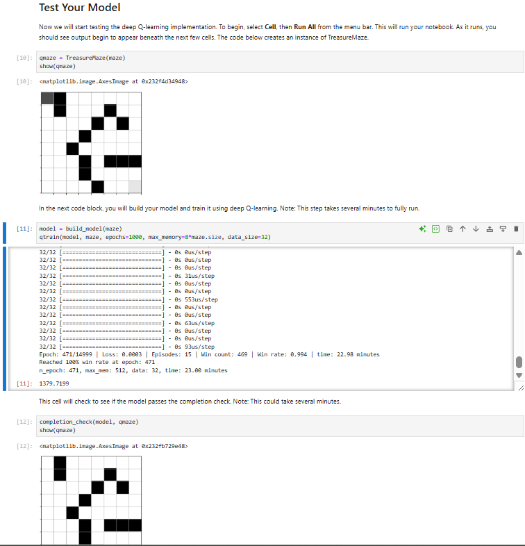

---

# Treasure Hunt Deep Q Learning Project  
CS 370 Current and Emerging Trends in Computer Science  
**Category:** Algorithms and Data Structures  

---

## Artifact Overview

The artifact I selected for this category is my **Treasure Hunt Deep Q Learning project** from **CS 370**. In the original assignment, I received partial starter code where only the structure of the `qtrain()` function existed. The core reinforcement learning logic—epsilon-greedy exploration, replay memory usage, batch training, and convergence control—was not implemented.

The project simulates a pirate agent navigating an **8×8 maze** to find treasure using **Deep Q Learning**. The assignment included:

- `TreasureMaze.py` – environment and state transitions  
- `GameExperience.py` – replay memory storage  
- A Jupyter Notebook with model building and incomplete training logic  

For the **CS 499 capstone**, I enhanced this artifact so it meets **industry expectations** for algorithm design, data structure usage, and clear documentation.

    

        &nbsp;&nbsp;&nbsp;
        
    

    
<em>Figure 1. The treasure maze environment and an example agent path toward the treasure.</em>

---

## Why I Selected This Artifact for My ePortfolio

This project demonstrates my ability to apply algorithms and data structures to solve a complex problem where:

- Decision making unfolds over time  
- Performance depends on tuning and optimizing the training process  
- Data structures like replay memory directly influence results  

This artifact highlights my strengths in:

✔ Reinforcement learning fundamentals  
✔ Q learning algorithm design  
✔ Replay memory behavior (queue-like implementation)  
✔ Algorithmic optimization and time complexity reasoning  
✔ Clean, professional documentation and readability  

Because it blends algorithm design, neural network decision making, and structured data usage, it strongly represents the **Algorithms and Data Structures** category.

---

## How the Artifact Was Improved

### **1. Dynamic Epsilon Reduction Based on Win Rate**

The original code used a fixed epsilon, causing excessive random exploration.  
In the enhanced version:

- Epsilon decreases only when the agent achieves a strong recent win rate  
- This prevents premature exploitation while controlling randomness  
- The agent converges faster and stabilizes sooner  

### **2. More Efficient Experience Replay Schedule**

The replay memory works like a **bounded queue**, storing past experiences for sampling.

Enhancements included:

- Allowing the buffer to warm up before training  
- Training only on **mini batches** instead of every step  
- Reducing temporal correlation and improving learning stability  

    

        &nbsp;&nbsp;&nbsp;
        
    

    
<em>Figure 2. Enhanced <code>qtrain()</code> logic and replay memory (buffer) usage.</em>

### **3. Documented Time Complexity for Algorithmic Components**

I added clear explanations of:

- Training loop complexity: **O(episodes × steps)**  
- Replay sampling complexity: **O(batch_size)**  
- Model prediction/update complexity per step  

This documentation shows I can evaluate a computing solution using algorithmic principles.

### **4. Improved Code Readability and Professional Documentation**

I rewrote comments to:

- Explain “why” the logic exists  
- Describe how Q learning components interact  
- Help future reviewers understand the algorithm flow  

This aligns with communication expectations for CS 499.

---

## Training Output Demonstrating Convergence

The final model shows:

- Stable loss  
- A sustained **100% win rate**  
- Correct completion of the assignment’s success criteria  

    
    
<em>Figure 3. Training output: stable convergence and achievement of 100% win rate at epoch 471.</em>

---

## Alignment to Course Outcomes

### **Outcome Three**  
**Design and evaluate computing solutions using algorithmic principles and data structures while managing trade offs.**

I met this outcome by:

- Implementing the full Q learning algorithm  
- Designing replay memory behavior using queue-like data structures  
- Managing exploration vs. exploitation tradeoffs  
- Analyzing time complexity and convergence behavior  

### **Outcome Four**  
**Use innovative techniques, skills, and tools in computing practices.**

This artifact demonstrates:

- Neural networks used for value approximation  
- Reinforcement learning applied to maze navigation  
- Replay memory and batch sampling from structured data  
- Practical AI development inside a Jupyter Notebook environment  

---

## Reflection on the Enhancement Process

Enhancing this project deepened my understanding of reinforcement learning mechanics, including:

- How data structures shape learning stability  
- How performance depends on balancing randomness and policy confidence  
- The importance of controlling model update frequency  
- How algorithmic documentation improves collaboration and readability  

One of the biggest challenges was avoiding premature convergence.  
By connecting epsilon to recent performance, I built a more adaptive agent.

I also learned the importance of:

- Modular code organization  
- Clear inline documentation  
- Careful parameter tuning  
- Visual inspection of training logs  

This enhancement now reflects my readiness to design algorithms, evaluate performance, and improve real-world AI systems.

---

## Repository and Files

Explore the enhanced artifact here:

**Artifact repository:**  
👉 *Update after upload:* `https://github.com/your-username/CS370-TreasureHunt-DeepQLearning`

The repository includes:

- `TreasureHuntGame-enhanced.ipynb` – main notebook with enhanced algorithm  
- `TreasureMaze.py` – environment logic  
- `GameExperience.py` – replay memory implementation  
- `screenshots/` – training output and maze graphics  
- `README.md` – instructions and documentation  

---

## References

Mnih, V. et al. (2015). *Human-level control through deep reinforcement learning*. Nature, 518(7540), 529–533. https://doi.org/10.1038/nature14236  

Sutton, R. S., & Barto, A. G. (2018). *Reinforcement Learning: An Introduction* (2nd ed.).  
https://web.stanford.edu/class/psych209/Readings/SuttonBartoIPRLBook2ndEd.pdf  

---

    <a href="#top">
        <button style="font-size: 10px; font-weight: 500; background: #ff6347; color: #ffffff; border-radius: 50px; border-style: solid; border-color: #ff6347; padding: 5px 8px;">
            Back to Top &#8593;
        </button>
    </a>

