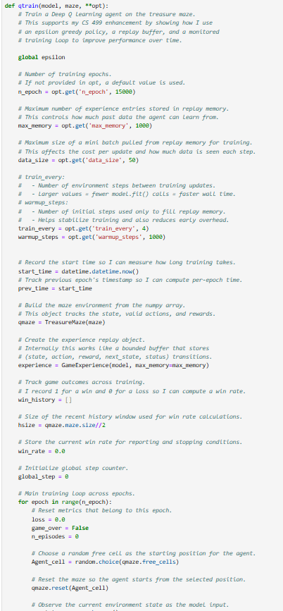

---

# Treasure Hunt Deep Q Learning Project  
CS 370 Current and Emerging Trends in Computer Science  
**Category:** Algorithms and Data Structures  

---

## Artifact Overview

The artifact I selected for this milestone is my **Treasure Hunt Deep Q Learning** project from **CS 370**. The original assignment included partial starter code where only the structure of the Q-learning training loop existed. My main task was to complete the logic inside the `qtrain()` function.

The project simulates a reinforcement learning agent navigating an eight-by-eight maze to reach a treasure. The assignment included:

- `TreasureMaze.py`
- `GameExperience.py`
- A Jupyter Notebook (`.ipynb`)

For the **CS 499 capstone**, I improved the algorithm, added documentation, optimized replay memory behavior, and performed a full training run demonstrating stable convergence.

---

## Why I Selected This Artifact

I selected this artifact because it demonstrates my ability to apply **algorithmic principles**, use **data structures**, evaluate performance, and improve the efficiency of a working AI model. The enhancements I made strengthened the algorithm while improving readability and usability.

Key skills shown:

- Reinforcement learning fundamentals  
- Experience replay buffer (queue-like structure)  
- Time complexity reasoning  
- Algorithm optimization for convergence  
- Professional-level documentation and code clarity  

---

## How the Artifact Was Improved

### 1. Epsilon Adjustment Based on Performance
I implemented an adaptive exploration strategy where epsilon decreases once the agent maintains a strong win rate. This helps the model:

- Explore early  
- Exploit learned policies later  

This accelerates convergence and reduces random movement once learning stabilizes.

---

### 2. Optimized Experience Replay Memory

I improved the replay memory workflow by:

- Allowing memory to warm up before training  
- Using scheduled mini-batch updates  
- Reducing correlated samples  
- Improving model stability  

    

        &nbsp;&nbsp;&nbsp;
        
    

    
<em>Figure 1. Enhanced <code>qtrain()</code> logic and replay memory implementation.</em>

---

### 3. Time Complexity Documentation

To meet the algorithms and data structures outcome, I documented:

- Training loop complexity  
- Mini-batch sampling cost  
- Model prediction operations  

This shows my ability to evaluate computing solutions using algorithmic reasoning.

---

### 4. Improved Readability and Documentation

I rewrote internal comments using simple college English, improving clarity and explaining:

- What each block does  
- Why it is needed  
- How it relates to RL behavior  

This improvement supports the communication outcome of CS 499.

---

## Training Output Demonstrating Convergence

I completed a full training session and recorded output demonstrating stable learning. The enhanced algorithm reaches a sustained win rate near one hundred percent.

    
    
<em>Figure 2. Training output graph demonstrating win rate and convergence.</em>

    
    
<em>Figure 3. Replay memory structure used during training.</em>

---

## Repository and Files

You can explore the enhanced version here:

### 🔗 **Enhanced Artifact Repository**
**https://github.com/rolandra1/CS370-Deep-Q-Learning-Cartpole-Enhanced**

### The repository includes:

- `TreasureHuntGame-enhanced.ipynb`  
- `TreasureMaze.py`  
- `GameExperience.py`  
- `/screenshots` folder with training and replay images  
- `README.md` documentation  

---

## References

Mnih, V., et al. (2015). Human-level control through deep reinforcement learning. *Nature, 518*(7540), 529–533. https://doi.org/10.1038/nature14236  

Sutton, R. S., & Barto, A. G. (2018). *Reinforcement learning: An introduction* (2nd ed.). MIT Press.  
https://web.stanford.edu/class/psych209/Readings/SuttonBartoIPRLBook2ndEd.pdf  

---

    <a href="#top">
        <button style="font-size: 10px; font-weight: 500; background: #ff6347; color: #ffffff; border-radius: 50px; border-style: solid; border-color: #ff6347; padding: 5px 8px;">
            Back to Top ↑
        </button>
    </a>

