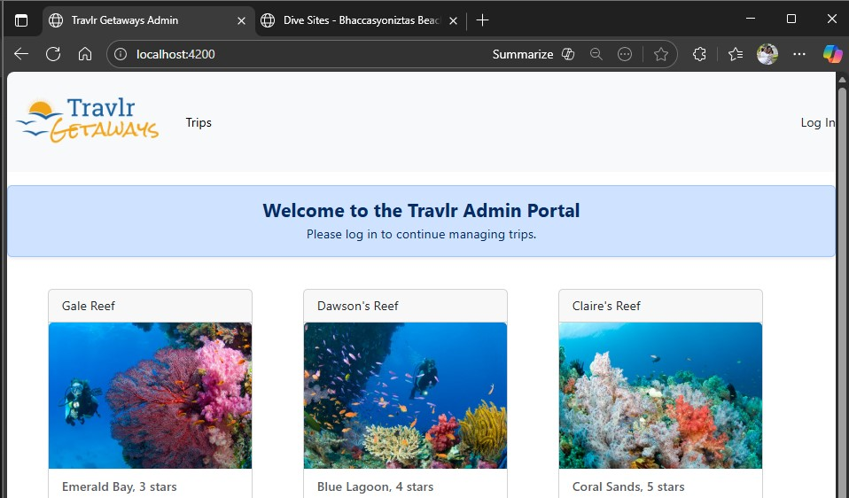
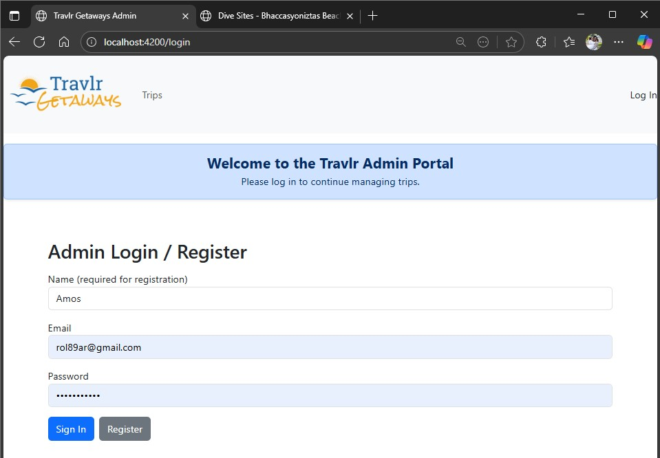

[-brightgreen.svg)](https://en.wikipedia.org/wiki/MEAN_(solution_stack)) 
 
 
 

---

# Travlr Getaways Full Stack Web Application  
CS 465 Full Stack Development I  
**Category:** Software Engineering and Design  

---

## Artifact Overview

The artifact I selected for my software design and engineering enhancement is my **Travlr Getaways Full Stack Web Application**, which I originally created in **CS 465 Full Stack Development I**. The project began as a partially functional travel listing website that used server side Handlebars templates. The early version did not fully support RESTful communication, persistent data storage, or secure authentication.

For the **CS 499 capstone enhancement**, I rebuilt Travlr Getaways as a true **MEAN stack** application using **MongoDB, Express, Angular, and Node.js**. I redesigned the admin portal as a modern single page application and added secure API endpoints, authentication workflows, and complete CRUD features for managing trips.

    

        &nbsp;&nbsp;&nbsp;
        
    

    
<em>Figure 1. Original CS 465 homepage and server-side code structure before enhancement.</em>

---

## Why I Selected This Artifact for My ePortfolio

I selected this artifact for my ePortfolio because it is the clearest representation of my growth as a full stack engineer. Travlr Getaways shows that I can design, develop, and enhance a complete software system using industry standard tools and patterns. The enhanced version demonstrates my skills in software architecture, API engineering, authentication systems, and user interface design.

Several parts of the project highlight my software engineering abilities:

- I implemented a complete **RESTful API** with clear GET, POST, PUT, and DELETE routes for trips.  
- I added secure **JSON Web Token authentication** using Passport and LocalStrategy.  
- I redesigned the **Angular admin portal** using modular components, service-based architecture, and reactive forms.  
- I implemented **Angular interceptors** to automatically attach authorization tokens on protected requests.  
- I improved the visual layout and added helpful features such as welcome messages and error handling for the admin experience.

These enhancements show that I can take an existing academic project and raise it toward a more professional full stack solution.

    

        &nbsp;&nbsp;&nbsp;
        
    

    
<em>Figure 2. Angular trip listing page logged out (left) and logged in with admin actions enabled (right).</em>

---

## How the Artifact Was Improved

For the capstone, I made several major improvements that moved the application from a simple course project into a more realistic full stack system.

### 1. Full MEAN Stack Architecture

The original project relied heavily on server-side Handlebars pages. In the enhanced version, I separated concerns more clearly:

- **Angular front end** for the admin single-page application.  
- **Express and Node.js backend** that exposes a clean RESTful API.  
- **MongoDB with Mongoose models** for persistent storage of trip data.  

This structure makes the application easier to maintain, test, and extend.

### 2. Secure Authentication and Authorization

I added **JWT-based authentication** with Passport:

- Users log in with a username and password.  
- On successful login, the server issues a **JSON Web Token**.  
- The Angular client stores the token and sends it with each protected request.  
- Angular **HTTP interceptors** attach the token automatically, so the code stays clean.  

Only authenticated users can access admin functions such as creating, editing, or deleting trips.

    

        &nbsp;&nbsp;&nbsp;
        
    

    
<em>Figure 3. Login screen and Add Trip reactive form used by authenticated admin users.</em>

### 3. Complete CRUD Features for Trips

The enhanced API and Angular front end now provide full CRUD support:

- **Create new trips** through a dedicated Add Trip form.  
- **Read and list trips** for both public users and logged in admins.  
- **Update existing trips** through an Edit Trip form that loads existing values.  
- **Delete trips** through admin controls that appear only when the user is authenticated.  

These improvements show that I can design and implement RESTful endpoints and connect them cleanly to a front end client.

### 4. Improved UI and Error Handling

I improved the user interface to make the admin portal easier to understand:

- Added a **welcome message** and clear headings for admin actions.  
- Displayed **validation messages** in reactive forms.  
- Handled server errors and authentication failures in a more user-friendly way.  

These changes show that I think about both functionality and user experience.

    

        &nbsp;&nbsp;&nbsp;
        
    

    
<em>Figure 4. Node API running successfully with confirmed MongoDB connection.</em>

---

## Alignment to Course Outcomes

In Module One of CS 499, I planned to use this artifact to meet the outcomes related to **software engineering and design** and to support my **security mindset**.

After the enhancement, this artifact supports several capstone outcomes:

- **Design and evaluate computing solutions using software engineering principles.**  
  - I used a layered MEAN architecture, clear separation of concerns, and RESTful API design.  

- **Use innovative techniques, skills, and tools in computing practices.**  
  - I applied modern tools such as Angular, Mongoose, JWT, and passport based authentication to create a realistic full stack application.  

- **Develop a security mindset that anticipates potential exploits.**  
  - I protected sensitive routes behind JWT authentication, avoided exposing admin features to anonymous users, and ensured that only authenticated requests can perform state changing actions.  

This artifact helped me fully demonstrate the software design and engineering category while also contributing to the security outcome for my capstone.

---

## Reflection on the Enhancement Process

Enhancing Travlr Getaways taught me how much effort it takes to move a classroom style project closer to a production style system. I learned several important lessons during this process.

First, I learned the value of the **separation of concerns**. When I isolated the Angular client from the Express API and the MongoDB models, my code became easier to reason about. Fixing a problem in one layer did not require me to untangle everything in the others. This experience made me more confident about designing modular systems in future projects.

Second, I gained a much stronger understanding of **authentication and authorization**. Implementing JWT security required me to think about how tokens are issued, how they are stored, and how they are attached to requests. I had to ensure that protected routes checked the token correctly and that the Angular client responded to invalid or expired tokens in a safe way.

Third, I improved my debugging and problem solving skills. I faced issues with CORS, mismatched URLs, and asynchronous calls between Angular and the API. Working through these problems step by step helped me become more patient and more systematic in my approach to full stack debugging.

Overall, this enhancement strengthened my confidence as a full stack developer. The updated Travlr Getaways application now shows that I can design, secure, and deliver a modern web application that follows industry practices and supports my long term goal of working in secure software development.

---

## Repository and Files

You can explore the enhanced artifact and supporting files in my GitHub repository: Artifact enhancement files repository at [CS465 Full Stack Development I](enhancement/CS465)

---

## References

Auth0. (n.d.). JSON Web Tokens. jwt.io. Retrieved November 12, 2025, from https://jwt.io/  

OWASP Foundation. (n.d.). OWASP Foundation. Retrieved November 13, 2025, from https://owasp.org/  

---

    <a href="#top">
        <button style="font-size: 10px; font-weight: 500; background: #90ee90; color: #ffffff; border-radius: 50px; border-style: solid; border-color: #90ee90; padding: 5px 8px;">
            Back to Top &#8593;
        </button>
    </a>

<!-- Anchor element placed at the top of the page -->

