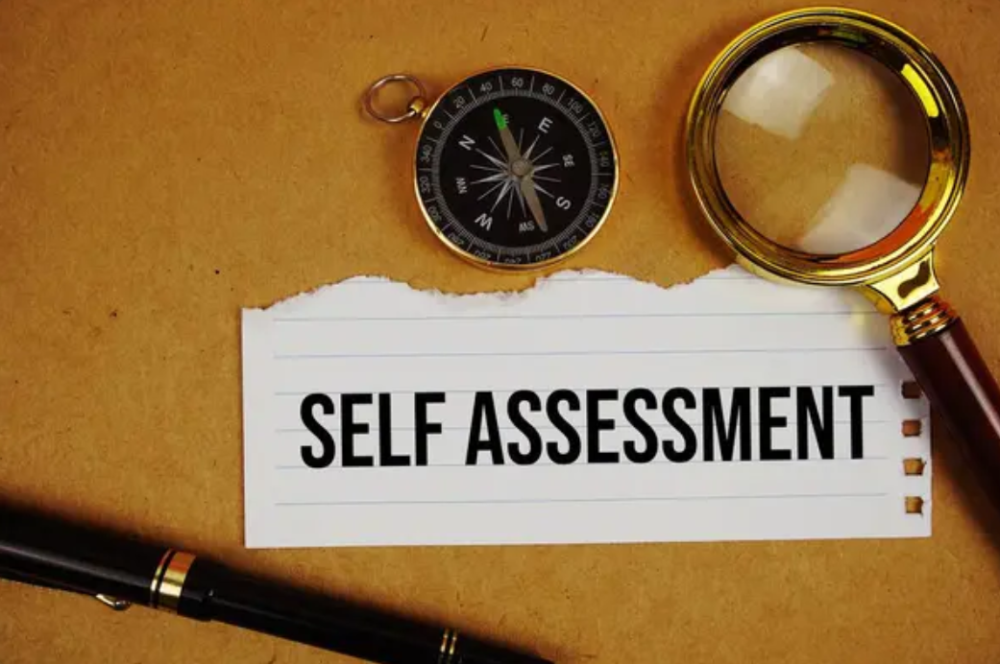
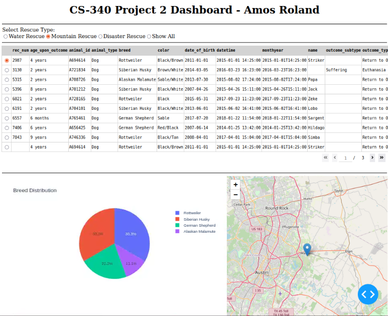
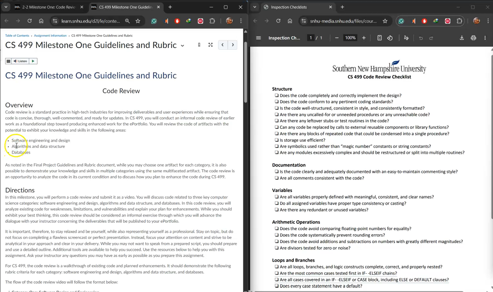
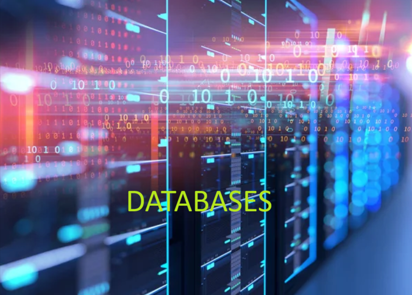

&nbsp;&nbsp;&nbsp;&nbsp;

## Welcome!

My ePortfolio presents my journey through the Computer Science program at Southern New Hampshire University and how it connects to my current work as a United States Navy Hospital Corpsman. It shows how I grew from a learner who was curious about information security into a computer science professional who can build secure, reliable, and user-friendly software.  

I designed this ePortfolio to communicate my skills clearly to a technical audience. It highlights my strongest work in software engineering and design, algorithms and data structures, and databases. Each artifact has been enhanced during my CS 499 Capstone to meet current industry expectations and the program outcomes for computer science.

Throughout my Computer Science program, I gained experience in programming, problem-solving, and application design. I worked with languages such as Java, Python, JavaScript, and SQL, and I explored areas like mobile development, full-stack web development, and artificial intelligence. Both individual and team projects helped me practice communication, collaboration, and documentation while I was also balancing my Navy responsibilities.

### <u>Table of Content</u>

&nbsp;[Professional Self-Assessment](#self-assessment "Self-Assessment") 
&nbsp;&nbsp;&nbsp;&nbsp;&nbsp;[_Portfolio Selections_](#portfolio-selections "Portfolio Selections") 
&nbsp;&nbsp;&nbsp;&nbsp;&nbsp;[_Future Career Preparation_](#future-career-preparation "Future Career Preparation") 
&nbsp;[Refinement Plan and Code Review](#codereview "Refinement Plan and Code Review") 
&nbsp;&nbsp;&nbsp;&nbsp;&nbsp;[_Code Review Videos Link_](#code-reviews-video-link "Artifacts Code Review Videos Link") 
&nbsp;[Software Design and Engineering](#softwaredesign "Software Engineering and Design") 
&nbsp;&nbsp;&nbsp;&nbsp;&nbsp;[_Artifact Software Design and Engineering_](#artifact-software-design-and-engineering "Artifact Software Design and Engineering") 
&nbsp;[Algorithms and Data Structure](#algorithms "Algorithms and Data Structure") 
&nbsp;&nbsp;&nbsp;&nbsp;&nbsp;[_Artifact Algorithms and Data Structures_](#artifact-algorithms-and-data-structures "Artifact Algorithms and Data Structures") 
&nbsp;[Databases](#databases "Databases") 
&nbsp;&nbsp;&nbsp;&nbsp;&nbsp;[_Artifact Databases_](#artifact-databases "Artifact Databases") 
&nbsp;[Reviews](#reviews "ePortfolio Reviews")

I started taking classes at Southern New Hampshire University in 2023 and fully to the Computer Science program. My short term goal was to complete an associate degree in computer science to see how my interest in technology and my early programming skills would fit in a formal program. After finishing the associate degree, I continued straight into the Bachelor of Science in Computer Science without a break.  

During that time, I was also serving as a Navy Hospital Corpsman and Radiation Health Technician, responsible for handling sensitive medical, radiation health, and readiness data. This experience made me take security, accuracy, and attention to detail very seriously. The computer science program helped me bring those habits into software design, secure coding, and data management.

While in the program, I developed practical skills in networking, security, mobile development, web development, and artificial intelligence. I learned to plan my code in small steps, test often, and think carefully about edge cases and vulnerabilities. As projects became more complex, I saw how important clear structure, documentation, and testing are for building reliable systems that other people can understand and maintain.

Working on group projects and discussions also helped me practice communication and leadership. I learned how to explain technical ideas in simple language, listen to feedback, and work with others toward a shared goal. These skills support both my future work in technology and my current role in the Navy.

    
    
<em>Figure 1 – Animal Shelter Dashboard – CS 340 Client/Server Development</em>

Through enhancements and a security-focused mindset, I have become more deliberate about how I design and review code. I break problems into manageable parts, follow consistent coding standards, and use testing and logging to verify that the system behaves as expected. Code reviews and self review also help me look for weaknesses that could lead to bugs or security issues.  

My coursework in database management, networking, and security gave me a foundation for working with data in a responsible way. I learned to think about who owns the data, who should access it, and how to protect it from misuse. This has been especially important to me because I already work with real people’s health information in my daily job.

| **Hard Skills** | **Soft Skills** |
|:--------------:|:---------------:|
| Programming in Java, Python, and JavaScript | Communication |
| Mobile app development (Android) | Adaptability |
| Web development (HTML, CSS, JS) | Problem solving |
| Full stack development (MEAN stack) | Time management |
| SQL and NoSQL databases | Organization |
| Data structures and algorithms | Attention to detail |
| Computer networking concepts | Teamwork |
| Operating systems fundamentals | Critical thinking |
| Secure coding practices | Leadership |
| Data analysis and visualization | Collaboration |

 

Throughout my journey in the computer science program, I improved my ability to learn new tools quickly and apply them in real projects. I combined my technical skills with a practical mindset from my military experience, which helped me stay focused, organized, and calm under pressure. The artifacts in this ePortfolio show how I moved from basic assignments to complete, enhanced solutions that are closer to real world systems.

As I continue to grow, my goal is to work in roles that combine software development and information security. I want to write code that is not only efficient for computers but also clear for humans, so that systems are easier to maintain, audit, and improve. This ePortfolio is one way I present that story to future employers and collaborators.

    <a href="#top">
        <button style="font-size: 10px; font-weight: 500; background: #6A5ACD; color: #ffffff; border-radius: 50px; border-style: solid; border-color: #6A5ACD; padding: 5px 8px;">Back to Top &#8593;</button>
    </a>

### _Portfolio Selections_

<blockquote style="font-size: 20px;">
  <em>"Code never lies, comments sometimes do."</em>
  
by Ron Jeffries

</blockquote>

Several courses in the Computer Science program had a major influence on my skills and on the artifacts I chose for this portfolio. Together, they helped me move from basic programming to designing and enhancing complete solutions.

CS 320 Software Testing, Automation, and Quality Assurance showed me how testing fits into every stage of the software lifecycle. I learned how to design test plans, write automated tests, and think like a tester so that I can catch issues before they reach users.  

CS 360 Mobile Architecture and Programming taught me how to design and build Android applications. In this course, I created a weight tracking application, which later became one of my enhanced artifacts. I learned about activities, layouts, data persistence with SQLite, and how user experience and performance relate to code structure.

CS 465 Full Stack Development I guided me through building a travel booking website using the MEAN stack. I worked with Node.js, Express, Angular, and MongoDB to create a full-stack solution with routing, views, and data storage. This project became the foundation for my full stack artifact and was later enhanced to follow better architecture and security practices.

CS 370 Current and Emerging Trends in Computer Science introduced me to artificial intelligence and neural networks. I worked on a reinforcement learning project that trained an agent to solve a control task. This experience influenced my algorithms and data structures artifact, where I improved and documented a Deep Q Learning solution.

Courses in security, system analysis, databases, and networking supported these projects:

- CS 305 Software Security helped me understand threats, secure design patterns, and encryption techniques.
- CS 255 System Analysis and Design gave me practice with requirements, diagrams, and system modeling.
- DAD 220 and related database courses helped me design and query structured data.
- Networking and operating systems topics helped me think about performance and communication between components.

    
    
<em>Figure 2 – Travel Booking Website – CS 465 Full Stack Development I</em>

From these courses, I chose three main artifacts to represent the CS 499 categories of Software Engineering and Design, Algorithms and Data Structures, and Databases. I selected:

- A full stack MEAN travel website  
- A reinforcement learning project that uses Deep Q Learning  
- A mobile weight tracking app backed by a secure database  

I enhanced each artifact to improve structure, performance, documentation, and security. These enhancements demonstrate that I can revisit earlier work, analyze it with a critical eye, and bring it closer to professional expectations.

    <a href="#top">
        <button style="font-size: 10px; font-weight: 500; background: #ff6347; color: #ffffff; border-radius: 50px; border-style: solid; border-color: #ff6347; padding: 5px 5px;">Back to Top &#8593;</button>
    </a>

### _Future Career Preparation_

Completing the Computer Science program prepared me to step into technical roles with confidence. The program did more than teach individual languages or tools. It trained me to think like a problem solver who can analyze a situation, design a solution, communicate clearly, and keep security in mind from the beginning.

I plan to apply these skills in roles related to secure software development, data security, and full-stack engineering. My background as a Navy Hospital Corpsman gives me experience with responsibility, accountability, and working in high stakes environments. My computer science training adds the technical side, including secure coding practices and the ability to design systems that protect sensitive information.

This ePortfolio is a key part of my preparation. It gathers my best work, shows before and after enhancements, and explains my decisions in language that technical reviewers can understand. It also reflects my commitment to continuous learning. As technology changes, I am ready to keep learning new frameworks, libraries, and security practices so that I stay ready for future challenges.

    <a href="#top">
        <button style="font-size: 10px; font-weight: 500; background: #008000; color: #ffffff; border-radius: 50px; border-style: solid; border-color: #008000; padding: 5px 5px;">Back to Top &#8593;</button>
    </a>

 

As a developing software engineer, I see code reviews as essential to building quality systems. They help catch bugs early, improve readability, and spread knowledge across a team. For my CS 499 Capstone, I completed a code review video where I walked through the original versions of my three artifacts, identified issues, and explained a plan for enhancement.

In my refinement plan, I focused on several themes:

- Improving structure and readability by refactoring functions, separating concerns, and renaming variables for clarity  
- Strengthening security by validating input, protecting credentials, and limiting access to data  
- Enhancing user experience by simplifying workflows, improving layout, and making feedback clearer  
- Adding comments and documentation so that future developers can understand design decisions

Through this process, I learned to look at my own code as if I were joining a new team and reviewing an existing system. This mindset will help me contribute to real projects where code already exists and needs to be improved instead of rebuilt from the ground up.

    
    
<em>Figure 3 – Enhanced Code Example from an Artifact</em>

### _Videos Link To Code Review_ {#code-reviews-video-link}

    

    <a href="#top">
        <button style="font-size: 10px; font-weight: 500; background: #6cb9c8; color: #ffffff; border-radius: 50px; border-style: solid; border-color: #6cb9c8; padding: 5px 5px;">Back to Top &#8593;</button>
    </a>

 

Through the [Refinement Plan and Code Review](https://rolandra1.github.io/CodeReview "Artifact Code Review"), the artifact selected for the Software Engineering and Design category is my **Travlr Getaways full stack travel website**, originally created in CS 465 Full Stack Development I. The application uses the MEAN stack (MongoDB, Express, Angular, Node.js) to let users browse trips, view details, and interact with travel data.

I selected this artifact because it represents a complete software system that includes routing, views, data access, authentication, and error handling. Enhancing this project required me to think about system architecture, modular design, maintainability, and security.

During enhancement, I:

- Cleaned up the backend structure by organizing controllers, models, and routes in a clearer way  
- Strengthened the API layer so that it followed REST principles more closely and returned consistent responses  
- Connected the Angular front end to the Express API in a more reliable way, with better error handling  
- Improved validation of inputs before they reached the database  
- Updated documentation and comments so that another developer could follow the flow from client to server to database

    &nbsp;&nbsp;&nbsp;
    
    
<em>Figure 4 – Backend Routes and Trip List Interface</em>

These enhancements show that I can design and evaluate computing solutions using sound software engineering practices. I considered trade offs such as complexity versus clarity and performance versus readability. I also used comments and logging to make the system easier to understand and maintain.

By focusing on separation of concerns and consistent patterns, I turned the project into a better example of a full stack architecture that can grow over time. This work directly supports my goal to build secure, maintainable web applications in my career.

### _Artifact Software Design and Engineering_ {#artifact-software-design-and-engineering}

    

    <a href="#top">
        <button style="font-size: 10px; font-weight: 500; background: #008000; color: #ffffff; border-radius: 50px; border-style: solid; border-color: #008000; padding: 5px 5px;">Back to Top &#8593;</button>
    </a>

 

For the Algorithms and Data Structures category, the artifact I selected is my **Deep Q Learning Cartpole project** from CS 370 Current and Emerging Trends in Computer Science. This project trains an intelligent agent to balance a pole on a moving cart using reinforcement learning.

The original version already showed how to use a neural network with Q learning to approximate the value function. During enhancement, I focused on the algorithmic side and on clarity:

- Refined the Q learning loop and experience replay logic to make the flow easier to follow  
- Tuned parameters such as the learning rate, discount factor, and exploration rate to study how they affected training  
- Improved the epsilon decay schedule to balance exploration and exploitation over time  
- Added detailed output that reported episode count, loss, rewards, and success rate so that I could evaluate convergence

    
    
    
<em>Figure 5 – Deep Q Learning Code and Training Results</em>

This artifact demonstrates that I can design and evaluate computing solutions using algorithmic principles and appropriate data structures. The replay buffer, action selection strategy, and neural network architecture all serve as parts of one algorithmic system.  

I also applied a security mindset by keeping dependencies updated and being careful about how I handle experiment data and scripts, especially when moving between environments. Clear comments, organized functions, and modular code make the notebook more reusable for future experiments or teaching.

### _Artifact Algorithms and Data Structures_ {#artifact-algorithms-and-data-structures}

    

    <a href="#top">
        <button style="font-size: 10px; font-weight: 500; background: #4169e1; color: #ffffff; border-radius: 50px; border-style: solid; border-color: #4169e1; padding: 5px 5px;">Back to Top &#8593;</button>
    </a>

 

For the Databases category, I selected my **Weight Tracking mobile application**, originally created in CS 360 Mobile Architecture and Programming. This Android app lets users create an account, log in, set a goal weight, and track daily entries over time.  

In the original version, data was stored in a simple SQLite structure. During enhancement for the capstone, I focused on improving database design, data protection, and maintainability:

- Restructured the SQLite tables to better separate user accounts, profile data, and weight entries  
- Implemented safer queries and parameterized statements to reduce the risk of SQL injection  
- Added logic to handle updates and deletes in a clean way, keeping data consistent  
- Introduced stronger handling for user credentials and other sensitive information, preparing the application for future encryption and cloud integration

    
    
    
<em>Figure 6 – Weight Tracker Login and Data Display Screens</em>

This artifact shows that I understand how application logic and databases work together. I designed and evaluated computing solutions that rely on persistent storage, and I aligned my enhancements with good database and security practices.  

The project also reflects my ability to document database behavior for other developers. By explaining table purpose, relationships, and key methods in the code, I make the app easier to extend, such as moving to a remote database or adding analytics in the future.

### _Artifact Databases_ {#artifact-databases}

    

    <a href="#top">
        <button style="font-size: 10px; font-weight: 500; background: #40E0D0; color: #ffffff; border-radius: 50px; border-style: solid; border-color: #40E0D0; padding: 5px 5px;">Back to Top &#8593;</button>
    </a>

## Reviews

> *You can add short quotes or feedback from professors, supervisors, or peers here to highlight external perspectives on your work and growth.*

    <a href="#top">
        <button style="font-size: 10px; font-weight: 500; background: #4169e1; color: #ffffff; border-radius: 50px; border-style: solid; border-color: #4169e1; padding: 5px 5px;">Back to Top &#8593;</button>
    </a>

