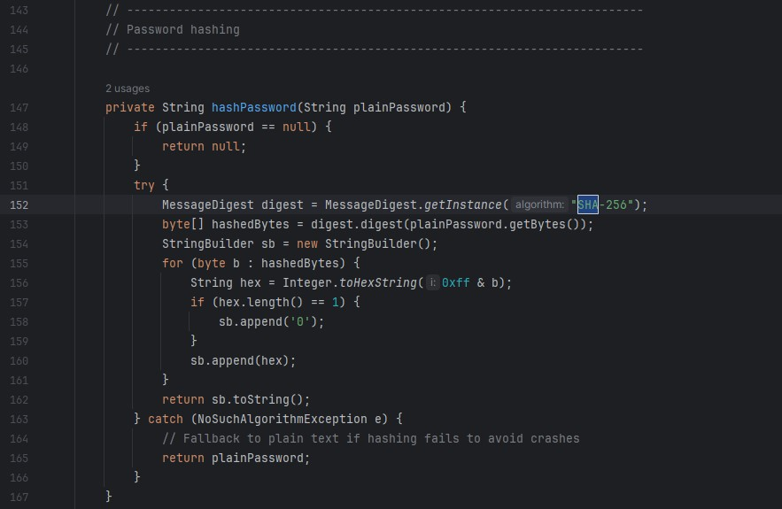
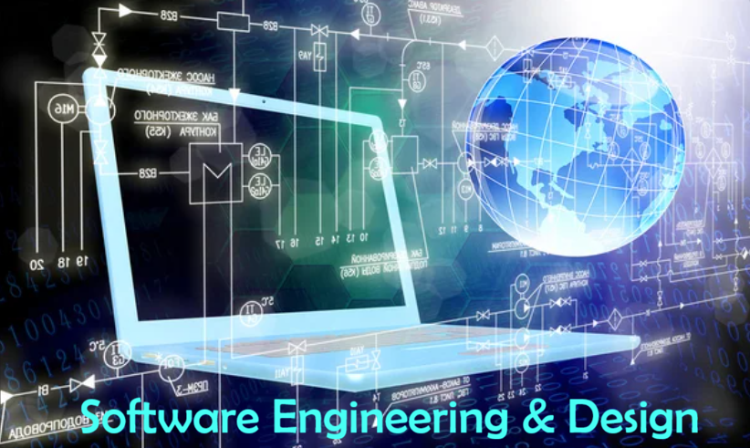
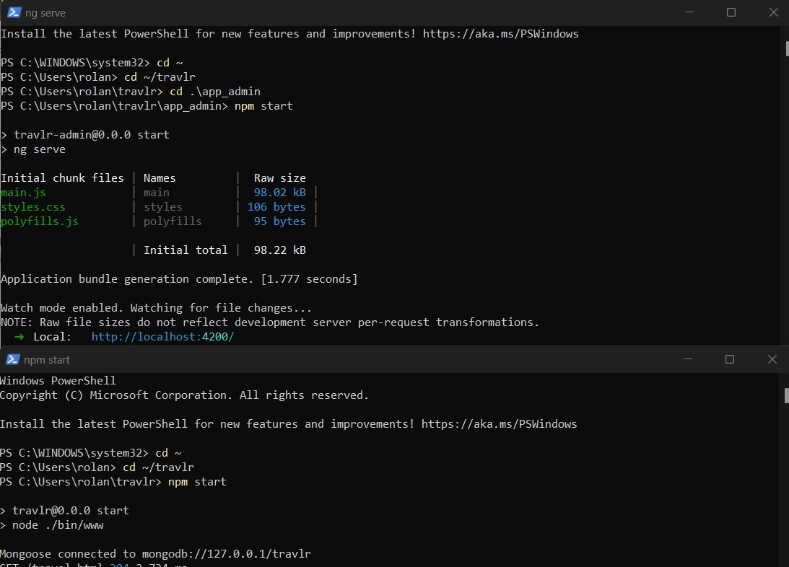
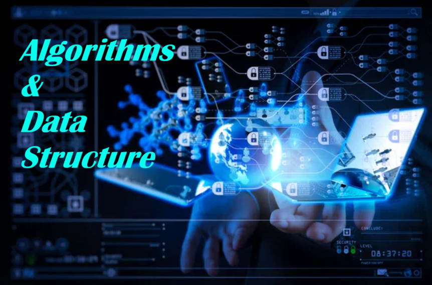
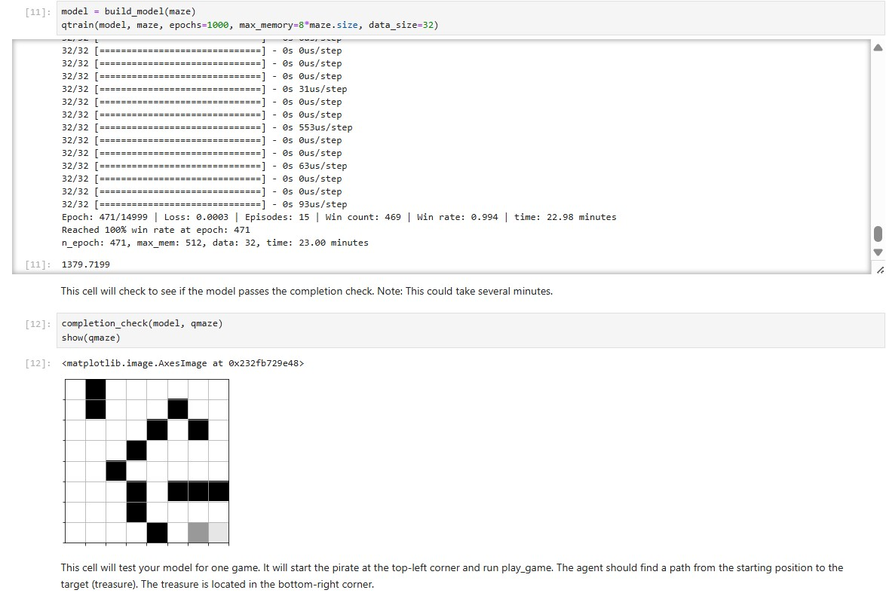
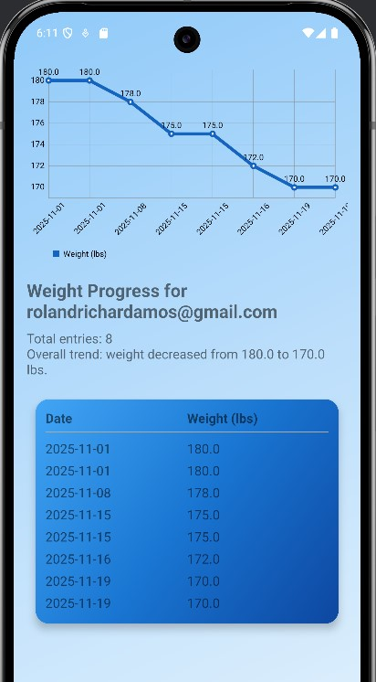

&nbsp;&nbsp;&nbsp;&nbsp;

# Welcome!

My ePortfolio presents my journey through the Computer Science program at Southern New Hampshire University and how it connects to my work in the United States Navy as a Hospital Corpsman and Radiation Health Technician. From the beginning, I entered the bachelor’s program with a concentration in Information Security because I felt called to protect systems the same way I protect people. My eagerness, aspirations, and inspiration to serve motivated me to start directly with the bachelor’s program instead of easing into it.

This ePortfolio highlights my strongest work in Software Engineering and Design, Algorithms and Data Structures, and Databases. These artifacts were enhanced during my CS 499 Capstone to meet professional industry standards and the program outcomes expected of a computer science graduate.

Throughout the program, I gained practical experience in programming, system design, secure coding, and real-world application development using Java, Python, JavaScript, SQL, and full-stack frameworks. Balancing Navy responsibilities with rigorous academic requirements strengthened my discipline, communication, and technical mindset.  

---

## <u>Table of Contents</u>

&nbsp;[Professional Self-Assessment](#self-assessment) 
&nbsp;&nbsp;&nbsp;&nbsp;&nbsp;[_Portfolio Selections_](#portfolio-selections) 
&nbsp;&nbsp;&nbsp;&nbsp;&nbsp;[_Future Career Preparation_](#future-career-preparation) 

&nbsp;[Refinement Plan and Code Review](#refinement-plan-code-review) 
&nbsp;&nbsp;&nbsp;&nbsp;&nbsp;[_Code Review Videos Link_](#codereview) 

&nbsp;[Software Engineering and Design](#softwaredesign) 
&nbsp;&nbsp;&nbsp;&nbsp;&nbsp;[_Artifact Software Design and Engineering_](#artifact-software-design-and-engineering) 

&nbsp;[Algorithms and Data Structures](#algorithms) 
&nbsp;&nbsp;&nbsp;&nbsp;&nbsp;[_Artifact Algorithms and Data Structures_](#artifact-algorithms-and-data-structures) 

&nbsp;[Databases](#databases) 
&nbsp;&nbsp;&nbsp;&nbsp;&nbsp;[_Artifact Databases_](#artifact-databases) 

&nbsp;[Reviews](#reviews) 

---

# Professional Self-Assessment

I began my Computer Science journey at Southern New Hampshire University in 2023 by entering directly into the bachelor’s program with a concentration in Information Security. I chose not to take the slower path because I already knew where I wanted to go. I wanted to secure systems, understand risks, and contribute to technologies that protect people and data. My eagerness, aspirations, and deep motivation to grow pushed me to commit fully from the start.

While studying, I continued serving in the United States Navy as a Hospital Corpsman and Radiation Health Technician. In this role, accuracy, confidentiality, and accountability are not optional; they are mission-critical. Handling sensitive medical and radiation health information gave me a natural foundation in security and reinforced my desire to specialize in Information Security within computer science.

The program helped me transform these instincts into technical expertise. I learned step-by-step problem solving, secure design, data structures, algorithms, and full-stack development. My concentration strengthened my understanding of encryption, authentication, network security, and real-world vulnerabilities.  

Balancing demanding Navy duties with academic expectations strengthened my discipline and resilience. Many nights, I moved straight from radiation health responsibilities into debugging code or completing major assignments. This process sharpened my communication, time management, and professional mindset.

Today, I stand as a developing computer science professional who understands the responsibility behind secure system design. My ePortfolio demonstrates this journey and how my background and education together shaped my professional identity.

---

## Skills Overview

| **Hard Skills** | **Soft Skills** |
|-----------------|------------------|
| Java, Python, JavaScript | Communication |
| Android mobile development | Adaptability |
| HTML, CSS, JS | Problem solving |
| MEAN full-stack development | Time management |
| SQL & NoSQL Databases | Organization |
| Data Structures & Algorithms | Leadership |
| Networking fundamentals | Teamwork |
| Operating Systems concepts | Critical thinking |
| Secure Coding Practices | Collaboration |
| Data Visualization | Attention to detail |

---

### Portfolio Selections

<blockquote style="font-size: 20px;">
  <em>"Security is not a product, but a process."</em>
  
– Bruce Schneier

</blockquote>

Several courses in the Computer Science program had a major influence on my skills and on the artifacts I chose for this portfolio. Together, they helped me move from basic programming to designing and enhancing complete solutions.

CS 320 Software Testing, Automation, and Quality Assurance showed me how testing fits into every stage of the software lifecycle. I learned how to design test plans, write automated tests, and think like a tester so that I can catch issues before they reach users.  

CS 360 Mobile Architecture and Programming taught me how to design and build Android applications. In this course, I created a weight tracking application, which later became one of my enhanced artifacts. I learned about activities, layouts, data persistence with SQLite, and how user experience and performance relate to code structure.

CS 465 Full Stack Development I guided me through building a travel booking website using the MEAN stack. I worked with Node.js, Express, Angular, and MongoDB to create a full-stack solution with routing, views, and data storage. This project became the foundation for my full-stack artifact and was later enhanced to follow better architecture and security practices.

CS 370 Current and Emerging Trends in Computer Science introduced me to artificial intelligence and neural networks. I worked on a reinforcement learning project that trained an agent to solve a control task. This experience influenced my algorithms and data structures artifact, where I improved and documented a Deep Q Learning solution.

Courses in security, system analysis, databases, and networking supported these projects:

- CS 305 Software Security helped me understand threats, secure design patterns, and encryption techniques.
- CS 255 System Analysis and Design gave me practice with requirements, diagrams, and system modeling.
- DAD 220 and related database courses helped me design and query structured data.
- Networking and operating systems topics helped me think about performance and communication between components.

    
    
<em>Figure 1 – Animal Shelter Dashboard – CS 340 Client/Server Development</em>

From these courses, I chose three main artifacts to represent the CS 499 categories of Software Engineering and Design, Algorithms and Data Structures, and Databases. I selected:

- Travlr Getaways – Full-Stack MEAN Application (CS 465)
- Deep Q-Learning Treasure Hunt – Reinforcement Learning Project (CS 370)
- Android Weight Tracking App – Secure SQLite Database (CS 360)

I enhanced each artifact to improve structure, performance, documentation, and security. These enhancements demonstrate that I can revisit earlier work, analyze it with a critical eye, and bring it closer to professional expectations.

    <a href="#top">
        <button style="font-size: 10px; font-weight: 500; background: #ff6347; color: #ffffff; border-radius: 50px; border-style: solid; border-color: #ff6347; padding: 5px 5px;">Back to Top &#8593;</button>
    </a>

---

### Future Career Preparation

The Computer Science program prepared me for roles in secure software development, cyber defense, and full-stack engineering. I learned to:

- Analyze complex systems  
- Design solutions with security built from the foundation  
- Communicate with technical and non-technical stakeholders  
- Evaluate risks and protect data  
- Adapt to new tools and frameworks quickly  

My ePortfolio is not just a collection of projects. It is a record of growth—showing not only what I learned but also how I improved earlier work through enhancements, reviews, and structured design.

    <a href="#top">
        <button style="font-size: 10px; background: #6A5ACD; color: white; border-radius: 50px; padding: 5px 8px;">Back to Top ↑</button>
    </a>

---

# Refinement Plan & Code Review

Code reviews helped me identify structural issues, improve readability, and strengthen security. My refinement plan focused on:

- Refactoring unclear or repeated logic  
- Enhancing readability and documentation  
- Improving authentication and secure handling of data  
- Strengthening input validation  
- Updating comments and code structure for professional clarity  

    
    
<em>Figure 2 – Example of Secure Password Handling in Enhanced Artifact</em>

### _Video Link_ {#codereview}

---

# Software Engineering & Design

For this category, I selected my **Travlr Getaways** full-stack web application. Enhancements included:

- Clearer backend structure using controllers/models/routes  
- Strengthened REST API behavior  
- Improved validation before database writes  
- Better error handling and modular design  
- Cleaner connection between Angular front-end and Express backend  

     &nbsp;&nbsp;
    
    
<em>Figure 3 – API Initialization and Logged-In Trip List</em>

### _Artifact: Software Engineering and Design_

    

---

# Algorithms & Data Structures

For this category, I selected my **Deep Q Learning Cartpole** project. Enhancements included:

- Cleaner training loop  
- Improved experience replay  
- Adjusted epsilon decay  
- Detailed performance reporting  

    
    
    
<em>Figure 4 – Deep Q Learning Code and Training Graph</em>

### _Artifact: Algorithms and Data Structures_

    

---

# Databases

For this category, I selected my enhanced **Weight Tracking App**. Enhancements included:

- Restructured SQLite tables  
- Parameterized queries for safety  
- Better handling of updates and deletes  
- Stronger data validation  
- Preparing the app for future encryption and cloud expansion  

    
    
    
<em>Figure 5 – CSV Export/Backup and Data Chart from Weight Tracker App</em>

### _Artifact: Databases_

    

---

# Reviews

> *“.”*

    <a href="#top">
        <button style="font-size: 10px; background: #4169e1; color: white; border-radius: 50px; padding: 5px;">Back to Top ↑</button>
    </a>

